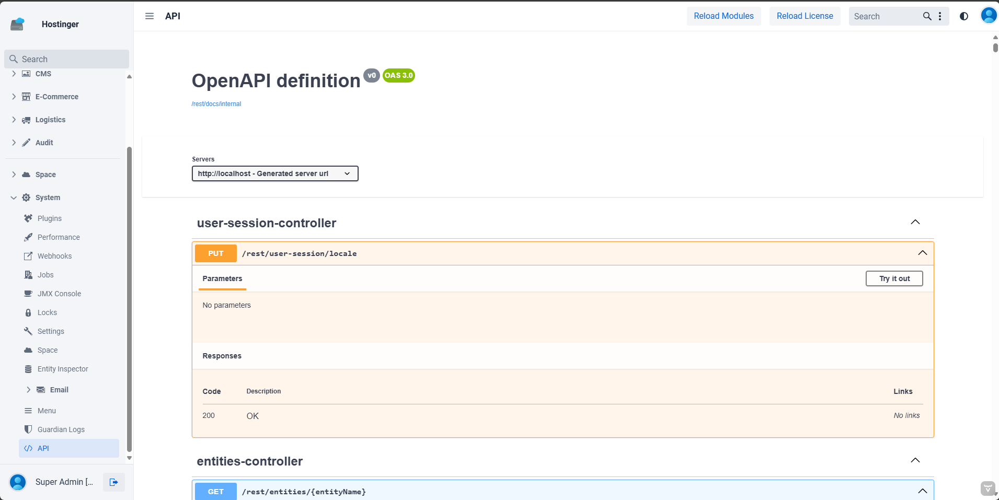

# JMIX Swagger-UI Component

The Swagger UI add-on allows internal documentation to be displayed with the user-friendly Swagger environment.

The addon provides an API Docs page in which the Swagger UI is integrated, but the component can also be integrated via
XML or as a Java object.

## Installation:

1. Add Maven Dependencies to your `build.gradle`.
    ```groovy
    implementation 'de.bytestore:swagger-ui'
    implementation 'de.bytestore:swagger-ui-starter' 
    ```
2. Add `xmlns:app="http://byte-store.de/schema/app-ui-components"` to your View Descriptor.

## Springdoc:

To generate API Docs for entire Projekt you can use Springdoc to generate Specs File.

1. Add following Configuration to your `application.yml`:
   ```properties
   springdoc.api-docs.path=/rest/docs/internal
   ```
2. Add Spring Doc Dependency to your `build.gradle`.
   ```groovy
   implementation 'org.springdoc:springdoc-openapi-starter-webmvc-ui'
   ```

## Implement basic Swagger UI

Via Java Component:

```java

@Subscribe
public void onInit(final InitEvent event) {
    SwaggerUI swaggerIO = new SwaggerIO();

    swaggerIO.setUrl("/rest/docs/openapi.json");

    getContent().add(swaggerIO);
}
```

Via View Descriptor XML:

```xml
<?xml version="1.0" encoding="UTF-8" standalone="no"?>
<view xmlns="http://jmix.io/schema/flowui/view"
      xmlns:app="http://byte-store.de/schema/app-ui-components"
      title="msg://apiDocs.title">
    <layout>
        <app:swagger-ui url="/rest/docs/openapi.json" id="swagger"/>
    </layout>
</view>
```

## Known limitations

- setUrls currently not working properly
- No Dark-mode/Theme Switcher Support currently

## Screenshots



Shield: [![CC BY-NC 4.0][cc-by-nc-shield]][cc-by-nc]

This work is licensed under a
[Creative Commons Attribution-NonCommercial 4.0 International License][cc-by-nc].

[![CC BY-NC 4.0][cc-by-nc-image]][cc-by-nc]

[cc-by-nc]: https://creativecommons.org/licenses/by-nc/4.0/

[cc-by-nc-image]: https://licensebuttons.net/l/by-nc/4.0/88x31.png

[cc-by-nc-shield]: https://img.shields.io/badge/License-CC%20BY--NC%204.0-lightgrey.svg