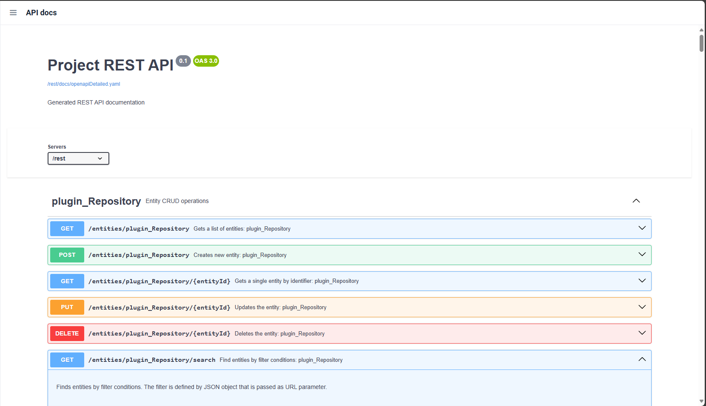
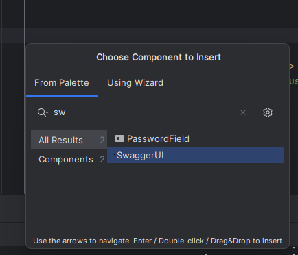

[](https://github.com/Gamer08YT/jmix-swagger-ui-addon/actions/workflows/release.yml) [](https://github.com/Gamer08YT/jmix-swagger-ui-addon/actions/workflows/test.yml)

# Jmix Swagger-UI Component

The Swagger UI add-on allows you to display internal API documentation with the user-friendly Swagger environment.

The add-on provides an API Docs page where Swagger UI is integrated. Additionally, the component can be embedded into
your application in alternate ways, either through XML configuration or as a Java object.



## Installation

The following table lists the add-on versions compatible with different Jmix platform versions:

| Jmix Version | Add-on Version | Dependency (Gradle Implementation)    |
|--------------|----------------|---------------------------------------|
| 2.4.2        | 1.1.6          | de.bytestore:swagger-ui-starter:1.1.6 |
| 2.5.0-RC1    | 1.2.0          | de.bytestore:swagger-ui-starter:1.2.0 |

**To use the add-on, you need to install either the Jmix REST Add-on or the Springdoc dependency; otherwise, no OpenAPI
Specification file will be generated.**

### Manual Installation

1. Add the following Maven dependency to your `build.gradle`:
    ```groovy
    implementation 'de.bytestore:swagger-ui-starter:<addon-version>'
    ```

2. Make sure to replace `<addon-version>` with the compatible version mentioned in the table above.

### Springdoc Configuration

If you want to generate API documentation for your entire project, you can use the Springdoc library to create a
specification file:

1. Add the Springdoc Maven dependency to your `build.gradle`:
    ```groovy
    implementation 'org.springdoc:springdoc-openapi-starter-webmvc-ui:<springdoc-version>'
    ```

   Replace `<springdoc-version>` with the appropriate version required for your project.

2. Configure the following property in your `application.yml` to specify the API documentation path:
    ```properties
    springdoc.api-docs.path=/rest/docs/internal
    ```

## How to Use the Add-On

### Via View Descriptor XML

You can add the Swagger UI component to your application by editing a View Descriptor XML file. This can be done easily
using Jmix Studio.



Alternatively, you can configure it manually through the following steps:

1. Add the required namespace to the `<view>` element:
    ```xml
    xmlns:app="http://byte-store.de/schema/app-ui-components"
    ```

2. Add the Swagger UI component inside the `<layout>` of the view:
    ```xml
    <?xml version="1.0" encoding="UTF-8" standalone="no"?>
    <view xmlns="http://jmix.io/schema/flowui/view"
          xmlns:app="http://byte-store.de/schema/app-ui-components">
        <layout>
            <app:swagger-ui url="/rest/docs/openapi.json" id="swagger"/>
        </layout>
    </view>
    ```

### Via Java Component

If you prefer adding the component programmatically, you can use the following approach:

```java

@Subscribe
public void onInit(final InitEvent event) {
    SwaggerUI swaggerUI = new SwaggerUI();
    swaggerUI.setUrl("/rest/docs/openapi.json");
    getContent().add(swaggerUI);
}
```

## Provided View

The add-on comes with a built-in API Docs page, available by default at `/api-docs`. It serves the Swagger UI and points
to the **REST API documentation** endpoint located at `/rest/docs/openapiDetailed.yaml`.

If needed, you can override the default API documentation URL by extending the provided `ApiDocs` view. Below is an
example:

#### View Controller

```java
package com.example.override.view;

import com.vaadin.flow.router.Route;
import de.bytestore.swaggerui.components.swagger.SwaggerUI;
import de.bytestore.swaggerui.view.apidocs.ApiDocs;
import io.jmix.flowui.view.*;

@Route(value = "api-docs", layout = DefaultMainViewParent.class)
@ViewController(id = "swagger_ApiDocs")
@ViewDescriptor(path = "test-api-docs.xml")
public class TestApiDocs extends ApiDocs {

    @ViewComponent("swagger")
    private SwaggerUI swagger;

    @Subscribe
    public void onBeforeShow(final BeforeShowEvent event) {
        swagger.setUrl("/rest/docs/internal"); // Override default URL.
    }
}
```

#### View Descriptor

```xml
<?xml version="1.0" encoding="UTF-8" standalone="no"?>
<view xmlns="http://jmix.io/schema/flowui/view"
      title="msg://de.bytestore.swaggerui.view.apidocs/apiDocs.title"
      messagesGroup="de.bytestore.swaggerui.view.apidocs"
      extends="de/bytestore/swaggerui/view/apidocs/api-docs.xml">
    <layout/>
</view>
```

## Limitations

- The `setUrls` method is currently non-functional.
- Dark Mode or Theme Switching is not yet supported by the component.

## Screenshots


---

### Licensing

Shield: [![CC BY-NC 4.0][cc-by-nc-shield]][cc-by-nc]

This work is licensed under a [Creative Commons Attribution-NonCommercial 4.0 International License][cc-by-nc].

[![CC BY-NC 4.0][cc-by-nc-image]][cc-by-nc]

[cc-by-nc]: https://creativecommons.org/licenses/by-nc/4.0/

[cc-by-nc-image]: https://licensebuttons.net/l/by-nc/4.0/88x31.png

[cc-by-nc-shield]: https://img.shields.io/badge/License-CC%20BY--NC%204.0-lightgrey.svg
